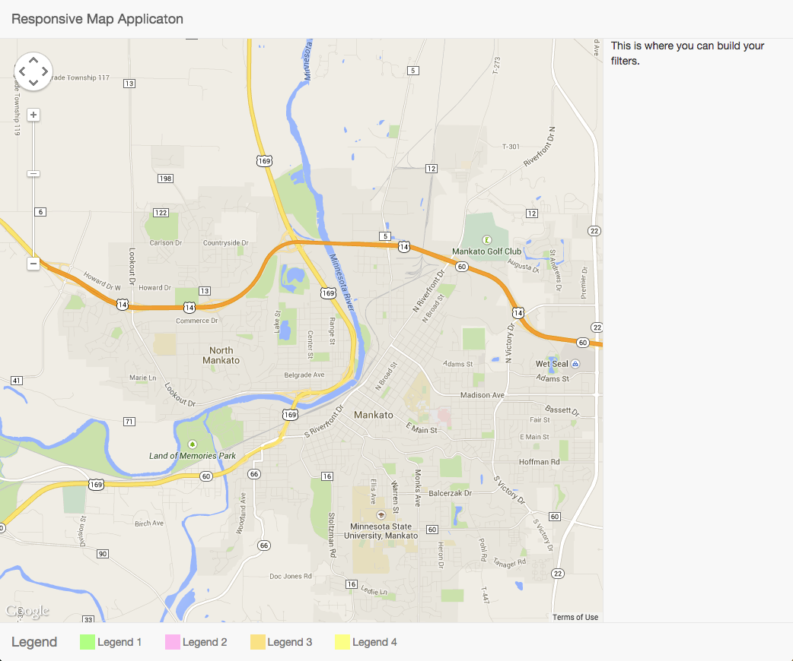
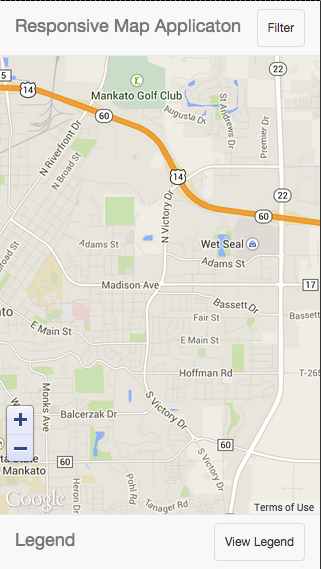

Google Maps Mobile Application Template
==========================

I was having a hard time figuring out a way to create a responsibe Google Maps application template. Here is what I was able to put together.

In the PC view you will have a menu bar on top, a filter on the side, and the legend on the bottom of the page.

In the mobile view, you have the menu on the top with a button to expand the filter on the side and the legend will be shown by clicking the bottom button.

