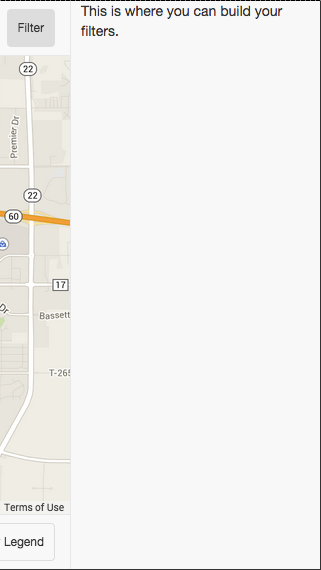
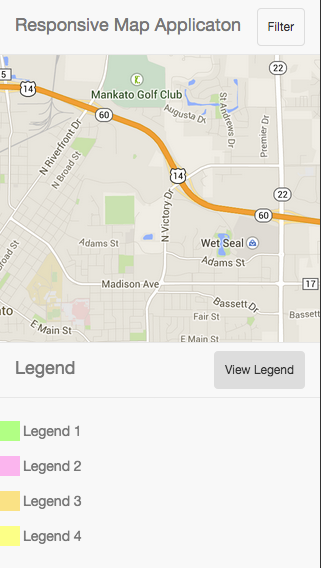

Google Maps Mobile Application Template
==========================

I was having a hard time figuring out a way to create a responsibe Google Maps application template. Learn more about this template from my [blog post](https://mikewills.me/2014/12/01/a-responsive-google-map-application-template.html).

[View a working version of the application](https://mikewills.me/GoogleMapsTemplate/GoogleMapsTemplate/)

In the PC view you will have a menu bar on top, a filter on the side, and the legend on the bottom of the page.

In the mobile view, you have the menu on the top with a button to expand the filter on the side and the legend will be shown by clicking the bottom button.

